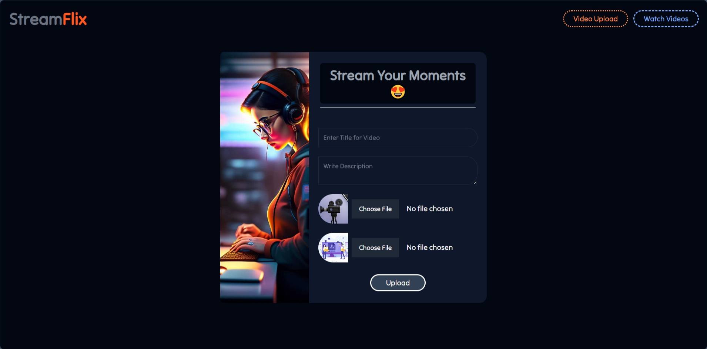
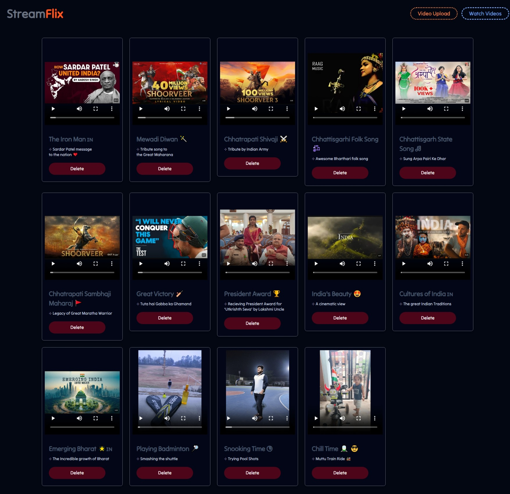

# :: StreamFlix Frontend :: 

>#### Developed a video streaming application with adaptive bitrate streaming using HLS (HTTP Live Streaming). Implemented video playback in multiple resolutions, ensuring seamless viewing experiences across devices.

- [Live Preview](https://streamflix-ui.vercel.app/)
- [CodeTime](https://wakatime.com/@Er_Jrsingh/projects/iidnypswgo)

> ### Learnings-
- Angular, React, Java, JavaScript, Spring boot, MySql, API 
- Vite, Axios, Flowbite 
- Video.js, Hls.js
- Cookie Management
- FFmpeg for Transcoding
- Byte range for buffering optimazation

> ### Snaps -

> > 

> >
